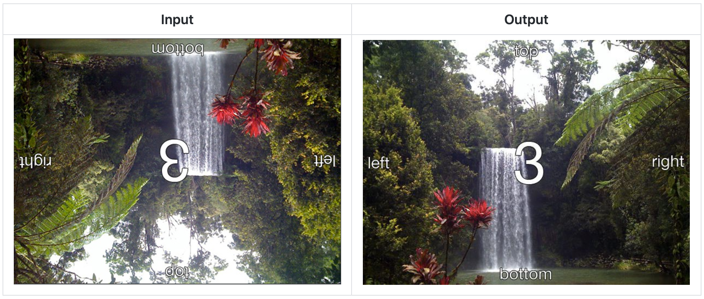

# ImageOrientationFix

PHP library to fix image orientation by exif data with thanks to method [exif_read_data](http://it2.php.net/manual/en/function.exif-read-data.php)

[](https://travis-ci.org/JellyBellyDev/ImageOrientationFix)
[](https://packagist.org/packages/jellybellydev/image-orientation-fix)
[](https://packagist.org/packages/jellybellydev/image-orientation-fix)
[](https://packagist.org/packages/jellybellydev/image-orientation-fix)
[](https://packagist.org/packages/jellybellydev/image-orientation-fix)
[](undefined)

## Image Example




## How to install

```bash
composer require jellybellydev/image-orientation-fix
```


## How to use

```php
use ImageOrientationFix\ImageOrientationFixer;

$iof = new ImageOrientationFixer('foo.jpg');
$iof->fix();
```
or
```php
use ImageOrientationFix\ImageOrientationFixer;

$iof = new ImageOrientationFixer('/path/foo.jpg', '/path/foo_fixed.jpg');
$iof->fix();
```

## Contributing

Dependencies are managed through composer:

```
$ docker-compose up --build -d
$ docker-compose run php74 composer install
```


### Run phpunit:

```
$ docker-compose run php74 composer test
```


### Run php-cs-fixer
``` bash
docker-compose run php74 composer cs-fixer
```


## Changelog

Please refer to the [changelog notes](CHANGELOG.md).


## Credits

Thanks to [recurser](https://github.com/recurser) for the [image example](https://github.com/recurser/exif-orientation-examples)
